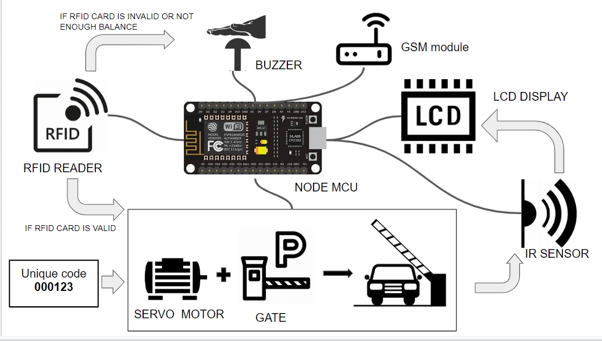
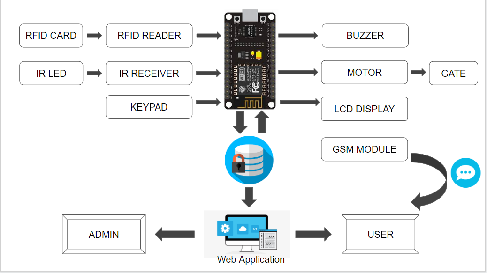
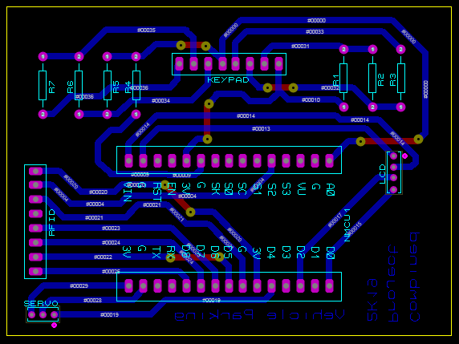

[comment]: # "This is the standard layout for the project, but you can clean this and use your own template"

# Automated Vehicle Parking System

---

## Team
-  E/15/076, DILEKA J.H.S., [sandushidileka2@gmail.com](mailto:sandushidileka2@gmail.com)
-  E/15/065, DE SILVA K.G.P.M., [prasadmadusankadasilva@gmail.com](mailto:prasadmadusankadasilva@gmail.com)
-  E/15/220, MALITHTHA K.H.H., [maliththamax@gmail.com](mailto:maliththamax@gmail.com)

## Table of Contents
1. [Introduction](#introduction)
2. [Solution Architecture](#solution-architecture )
3. [Hardware & Software Designs](#hardware-and-software-designs)
4. [Links](#links)

---

## Introduction

Vehicle Parking areas usually have people who give printed tickets for parking. This consumes a lot of time and which causes a lot of traffic. Along with causing traffic and commotion, there is also a lot of paper litter outside the vehicle parking areas.As the number of vehicles are increasing, the problems faced by manual parking management system are also increasing. Such problems can be eliminated to some extent by implementing an intelligent parking system where the entry and exit of cars is monitored and payment is made easy with sensor technology.In order to avoid all of these, Automated Vehicle Parking System can be used. This project uses an RFID which can be swiped at the entrance.

## Solution Architecture

* RFID Card for registered users  
* Tag for unregistered users  
* No paper tickets  
* No waitings and checkings at the gate  
* Time informed by a message  
* Automated payments

## Hardware and Software Designs  

### Data Flow and Infrastructure  
  
### Overall Process  
  
### PCB Design for the Vehicle Parking System  

## Links

### Document  
- [Project Proposal](docs/data/pdf/ProjectProposalRevision.pdf)

### Testing  
- [Progress](docs/data/videos/Progress_1.mp4)

### Other Links
- <a href = "https://github.com/cepdnaclk/e15-3yp-Automated-Vehicle-Parking-System" target = "_blank"> Project Repository </a>
- <a href = "https://cepdnaclk.github.io/e15-3yp-Automated-Vehicle-Parking-System/" target = "_blank">Project Page</a>
- <a href = "http://www.ce.pdn.ac.lk/" target = "_blank">Department of Computer Engineering</a>
- <a href = "https://eng.pdn.ac.lk/" target = "_blank">University of Peradeniya</a>

[//]: # (Please refer this to learn more about Markdown syntax)
[//]: # (https://github.com/adam-p/markdown-here/wiki/Markdown-Cheatsheet)
